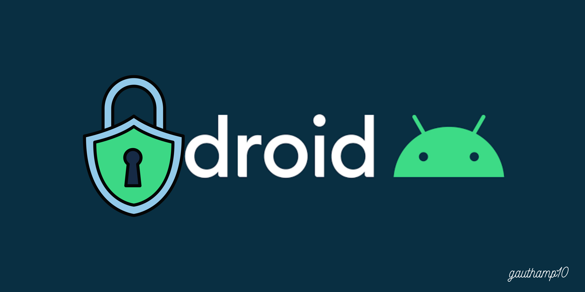

## Android App Permission Dataset

### Permission data of 2.2 million android application from Google Playstore.



For latest dataset updates. Download from Kaggle: https://www.kaggle.com/gauthamp10/app-permissions-android

I've collected the data with the help of Python and Scrapy running on a cloud virtual machine with the United States as geolocation.
The data was collected on June 2021.

### Sample

```
[
    {
        "appId": "com.whatsapp",
        "appName": "WhatsApp Messenger",
        "allPermissions": [
            {
                "permission": "directly call phone numbers",
                "type": "Phone"
            },
            {
                "permission": "read call log",
                "type": "Phone"
            },
            {
                "permission": "read phone status and identity",
                "type": "Phone"
            },
            {
                "permission": "precise location (GPS and network-based)",
                "type": "Location"
            },
            {
                "permission": "approximate location (network-based)",
                "type": "Location"
            },
            {
                "permission": "modify or delete the contents of your USB storage",
                "type": "Photos/Media/Files"
            },
            {
                "permission": "read the contents of your USB storage",
                "type": "Photos/Media/Files"
            },
            {
                "permission": "send SMS messages",
                "type": "SMS"
            },
            {
                "permission": "receive text messages (SMS)",
                "type": "SMS"
            },
            {
                "permission": "modify or delete the contents of your USB storage",
                "type": "Storage"
            },
            {
                "permission": "read the contents of your USB storage",
                "type": "Storage"
            },
            {
                "permission": "retrieve running apps",
                "type": "Device & app history"
            },
            {
                "permission": "take pictures and videos",
                "type": "Camera"
            },
            {
                "permission": "record audio",
                "type": "Microphone"
            },
            {
                "permission": "view Wi-Fi connections",
                "type": "Wi-Fi connection information"
            },
            {
                "permission": "modify your contacts",
                "type": "Contacts"
            },
            {
                "permission": "find accounts on the device",
                "type": "Contacts"
            },
            {
                "permission": "read your contacts",
                "type": "Contacts"
            },
            {
                "permission": "read phone status and identity",
                "type": "Device ID & call information"
            },
            {
                "permission": "read your own contact card",
                "type": "Identity"
            },
            {
                "permission": "find accounts on the device",
                "type": "Identity"
            },
            {
                "permission": "add or remove accounts",
                "type": "Identity"
            },
            {
                "permission": "change your audio settings",
                "type": "Other"
            },
            {
                "permission": "install shortcuts",
                "type": "Other"
            },
            {
                "permission": "create accounts and set passwords",
                "type": "Other"
            },
            {
                "permission": "prevent device from sleeping",
                "type": "Other"
            },
            {
                "permission": "run at startup",
                "type": "Other"
            },
            {
                "permission": "toggle sync on and off",
                "type": "Other"
            },
            {
                "permission": "view network connections",
                "type": "Other"
            },
            {
                "permission": "full network access",
                "type": "Other"
            },
            {
                "permission": "change network connectivity",
                "type": "Other"
            },
            {
                "permission": "use accounts on the device",
                "type": "Other"
            },
            {
                "permission": "read Google service configuration",
                "type": "Other"
            },
            {
                "permission": "control vibration",
                "type": "Other"
            },
            {
                "permission": "control Near Field Communication",
                "type": "Other"
            },
            {
                "permission": "uninstall shortcuts",
                "type": "Other"
            },
            {
                "permission": "pair with Bluetooth devices",
                "type": "Other"
            },
            {
                "permission": "connect and disconnect from Wi-Fi",
                "type": "Other"
            },
            {
                "permission": "read sync settings",
                "type": "Other"
            },
            {
                "permission": "send sticky broadcast",
                "type": "Other"
            }
        ]
    }
]

```

Also checkout the Google Play Store Apps dataset: https://github.com/gauthamp10/Google-Playstore-Dataset

### Acknowledgements

I couldn't have build this dateset without the help of Digitalocean and github.

### __Author__

 **Gautham Prakash**
 
  My other projects: [github.com/gauthamp10](https://github.com/gauthamp10)

  Website: [gauthamp10.github.io](https://gauthamp10.github.io)


### __License__  

This project is licensed under the  License - see the THE CREATIVE COMMONS ATTRIBUTION 4.0 INTERNATIONAL [LICENSE](LICENSE.md) file for details
